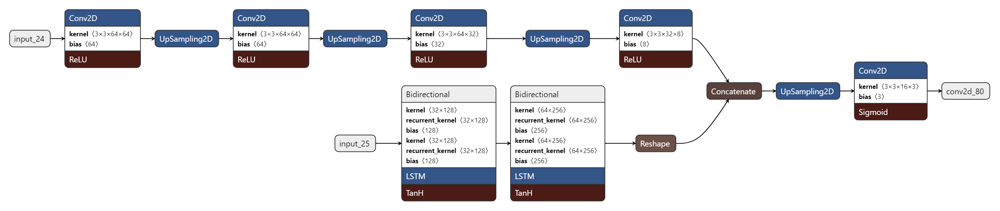
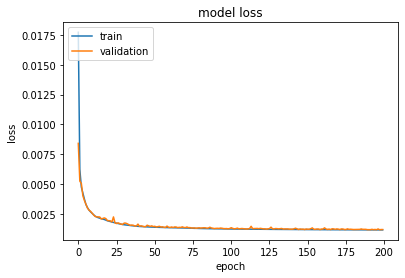
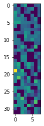
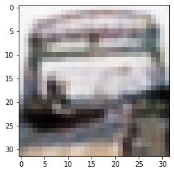

# 32x32x3

We are going to use the following structure of autoencoder :

<table>
	<tr>
		<td>Encoder</td>
		<td>Image encoded</td>
    		<td>Decoder</td>
	</tr>
	<tr>
		<td></td>
    		<td></td>
    		<td></td>
	</tr>
</table>

As you can see, the aim here is to write a 32x32x3 image as a 32x16 image + a 32x8 image i.e. to write a 3072 dimensional vector as a 768 dimensional vector.

## Installation

Please use the command below :

~~~
!python3 -m pip install --ignore-installed -r requirements.txt  
~~~

## Example & usage

Start by instancing a model precising the shape of your data in ``input_shape`` :

~~~
model=Model(input_shape)
~~~

Then you can train your model as follows :

~~~
model.train(training_set, save_path=path/to/the/directory/to/save/models)
~~~

You can also load weights from a pre-trained model with methods ``model.load_autoencoder(self, path)`` , ``model.load_encoder(path)`` and ``model.load_decoder(path)`` . Now you
can code and decode your data like below :

~~~
encoded=model.encode(data)
decoded=model.decode(encoded)
~~~

In my case, I trained the model on the CIFAR-100 dataset and here are some results. First, during the training, we reached 0.0012 mse score in 200 epochs with a batch size of 32 : 

After evaluating the autoencoder on the test set, we got a mse score of 0.001189597561582923. Here are some results on the test set :

<table>
	<tr>
		<td>Input</td>
		<td></td>
    		<td></td>
		<td></td>
    		<td></td>
    		<td></td>
	</tr>
	<tr>
		<td>Encoded</td>
		<td>
			</td>
    		<td>
			</td>
		<td>
			</td>
    		<td>
			</td>
    		<td>
			</td>
	</tr>
	<tr>
		<td>Decoded</td>
		<td></td>
    		<td></td>
		<td></td>
    		<td></td>
    		<td></td>
	</tr>
</table>
