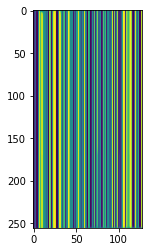

# High Resolution

## Introduction

Our goal here is first to reduce the high-resolution image into a low-resolution image (basically we downscale a (2048, 2048, 3) array in a (512, 512, 3) array). Then we develop
an extension of the 32x32x3 compressor for images with shape (512, 512, 3). The low-resolution image will be compressed in 2 vectors of shape (32, 32, 128) and (256, 128). Let's 
summary what we are going to do : as input we get a 12 509 292 dimensional vector that we want to compress into a 163 840 dimensional vector. 

For the first step, we are going to use a RRDN structure :

<table>
  <tr>
    <td>High-resoltuion -> Low-resolution</td>
  </tr>
  <tr>
    <td></td>
  </tr>
  <tr>
    <td>Low-resoltuion -> High-resolution</td>
  </tr>
  <tr>
    <td></td>
  </tr>
</table>

and train both model on the div2K dataset (using only the LRx4 bicubic package). Remind for later that this stage is very demanding on RAM resources ! The second step is the same as what we did for 32x32x3 compression.

## Results

We reach a mse of 0.0044 in 400 epochs for the autoencoding of low-resolution images as you can see below :

And finally we have succesfully reach our goal :

<table>
  <tr>
    <td>High-resoltuion</td>
    <td>Low-resolution</td>
    <td>Encoded image</td>
    <td>Decoded image</td>
    <td>Upscaled image</td>
  </tr>
  <tr>
    <td></td>
    <td></td>
    <td> </td>
    <td></td>
    <td></td>
  </tr>
</table>

## Usage

Let's begin by using the class div2k available in the 
